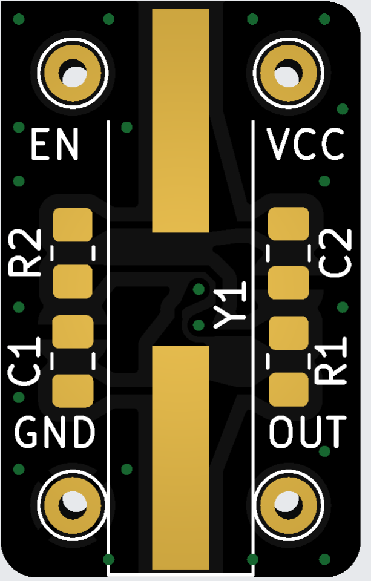
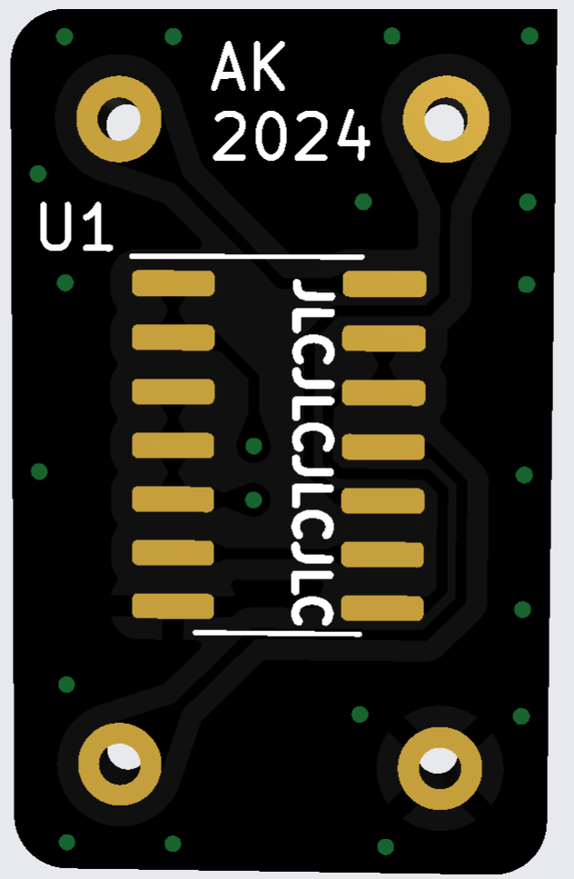

# DIYosc

I thought I had integrated 8 MHz DIP-14 oscillator, turned out I did not. It
also proved not that easy to buy. But I had 8 MHZ HC49-SD crystals, so I decided
to design a replacement. This PCB should allow usage of pretty much whichever
crystal, but R1, R2, C1 and C2 should be picked accordingly.

# Photos

